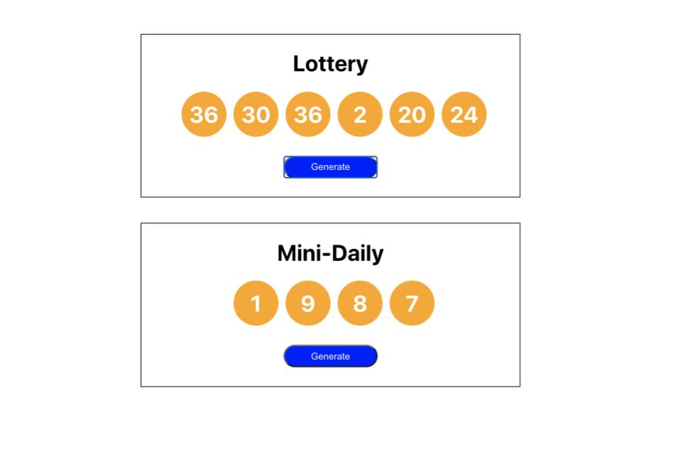

# **Lottery**

## Description
This was an exercise from the Udemy course, "The Modern React Bootcamp" by Colt Steele.  This exercise was for educational purposes and was used to practice React state, designing state, minimizing state, and centralizing state.  The exercise also emphasizes making components reusable and using props.  Clicking on the 'Generate' button generates random numbers.  The numbers generated also depends on the props passed into the components.

## Screenshot
